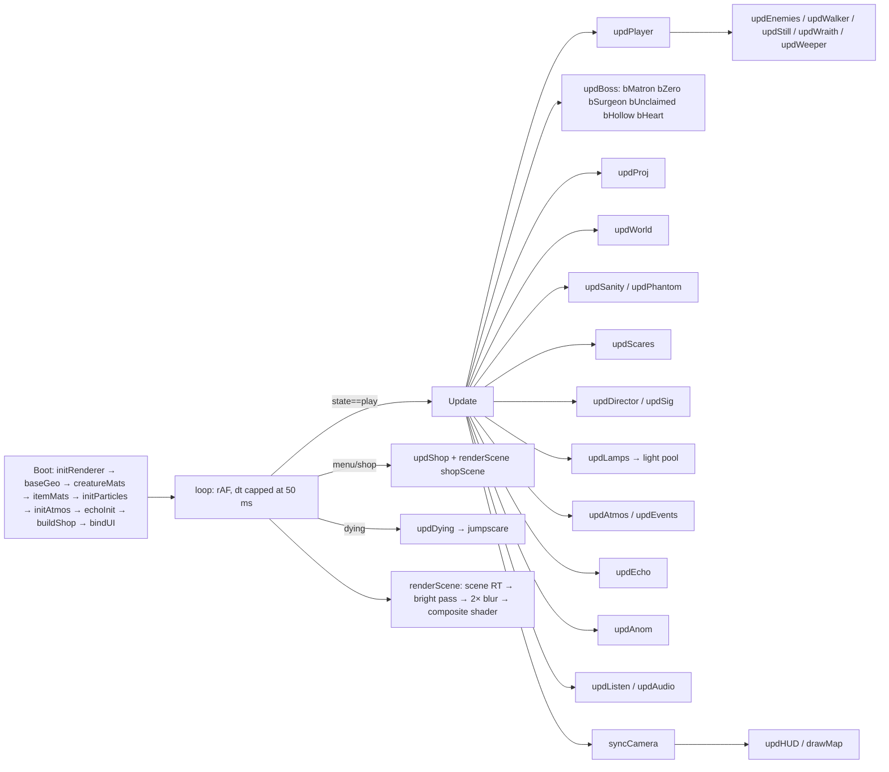

# Ward 13 — Architecture

The whole game is one HTML file, `ward13/index.html`, of about 2,750 lines. It has:
- inline CSS and HTML for the screens
- one game closure, `window.gameBoot`
- a boot script that loads three.js r128

All art and audio are procedural: canvas textures, lathe and icosahedron geometry, and WebAudio synthesis. There are no external assets.

## Files

| Path | Purpose |
|---|---|
| `index.html` | The game. All of its code lives in the `window.gameBoot` closure. |
| `vendor/three.min.js` | three.js r128 (MIT, see `vendor/THREE_LICENSE`). It is used by the offline build and the tests. |
| `tools/build.mjs` | Builds `Ward13.html`, a single self-contained offline file with three.js inlined. |
| `tests/qa.mjs` | Headless Chromium QA harness with 12 scenarios. See the QA section below. |
| `agent_docs/*.md` | Audit, roadmap, change log, QA and performance reports. |

## System map



**State machine** (the `state` variable):
- Boot and normal play: `boot → menu → intro → loading → play ⇄ paused | note`.
- Death: `play → dying → dead → (retry) loading`.
- Floor clear: `play → done → shop → loading`.
- Finishing floor 30: `play → ending`.
- Blur, a hidden tab, or losing pointer lock auto-pauses.

## Module table

| Module (section in `index.html`) | Responsibility | Key functions | Health |
|---|---|---|---|
| Settings, save and catalogue | `localStorage` keys `w13.settings` and `w13.save` (v:3). The upgrade (`UPG`) and supply (`SUP`) catalogues. | `lsGet/lsSet`, `newSave`, `persist`, `up` | 3: no validation of loaded data |
| Audio | WebAudio graph: compressor → muffle low-pass → master. Reverb convolver, drone and tension pad. Every sound is synthesized. | `audioInit`, `tone`, `hiss`, `SFX.*`, `setDrone`, `setTension` | 4 |
| Renderer and post | WebGLRenderer with linear output into a half-float render target. Bloom, god rays and the composite shader (ACES, grain, vignette, damage, VHS). A height fog patched into the shader chunks. | `initRenderer`, `patchFog`, `renderScene`, `resize` | 4 |
| Procedural textures | 1024² canvas paint for walls, floors and ceilings per wing. Normal maps (`nmap`) and roughness maps (`rmap`) are derived on the CPU. | `wallTex/floorTex/ceilTex/commonTex`, `nmap`, `rmap` | 2: CPU-heavy, dominates load time |
| Geometry and creatures | Lathe and blob helpers. A skinned humanoid rig (hips, spine, chest, clavicles, neck, head, jaw, limbs). Monster builders and boss builders. | `humanoid`, `animBiped`, `secMotion`, `mPatient…mHeart` | 4 |
| Floors and layout | Grid levels (`L.g`: 0 floor, 1 wall, 2 door). The wing and boss tables, the quest sequence (`QSEQ`) and the notes. BFS pathfinding and an obstacle grid. | `genLayout`, `genArena`, `findPath`, `blockedAt`, `moveC`, `los` | 4 |
| Building | Turns the layout into meshes: shell, props, lamps, doors, pipes, decals, elevators and quest objects. | `buildLevel`, `place*`, `questSetup`, `disposeWorld` | 4 |
| Player | Movement, stamina, battery, UV beam, flashes, jumping, crouching, hiding, items. | `updPlayer`, `hurt`, `useItem`, `cameraFlash`, `interact` | 4 |
| Lights | A pool of real point lights handed to the nearest lit lamps. Flicker, alarm and blackout modes. | `initPool`, `updLamps`, `lampLevel`, `litAt` | 4 |
| Enemies | Patient, still (mannequin), crawler, wraith, weeper. State machines with perception (LOS, beam, noise), search plans and path following. | `spawnEnemy`, `updWalker`, `updStill`, `updWraith`, `updWeeper`, `searchPlan` | 4 |
| Bosses | Six bespoke fights, each with its own mechanic. | `bossSetup`, `updBoss`, `b*` | 4 |
| The Echo | A stalker NPC that mimics the player, carries a light and remembers where you hide. | `echo*`, `updEcho` | 4 |
| Horror pacing | Random scares, sanity phantoms, set-piece events, the unseen-change director, and the fear director (`DIR`) with its signature scares. | `updScares`, `updPhantom`, `updEvents`, `updAnom`, `updDirector`, `sig*` | 3: the fear director's scares are not cleaned up when the player leaves a floor |
| UI and HUD | DOM HUD, meters, belt, map canvas, prompts, screens (`show(id)`), the shop. | `updHUD`, `drawMap`, `renderShop`, `show` | 4 |
| Flow | Starting and finishing floors, death, ending, menu, pause. | `startFloor`, `completeFloor`, `die`, `toMenu`, `pause`, `resume` | 3: `toMenu` does not reset the fear director |
| Safety nets | A self-test that falls back to safe mode (no post-processing). Dynamic resolution. | `selfTest`, `enterSafeMode`, `perf` | 3: the resolution drop is one-way |
| Input | Keyboard and mouse with pointer lock, plus a fallback when the lock is refused. No gamepad, no rebinding. | `bindUI` | 3 |

## Update order (one frame in `play`)
1. `updPlayer`
2. `updEnemies`
3. `updBoss`
4. `updProj`
5. `updWorld`
6. `updSanity`
7. `updPhantom`
8. `updScares`
9. `updDirector`
10. `updLamps`
11. `updAtmos`
12. `updEcho`
13. `updAnom`
14. `updListen`
15. `updPeek`

Then particles, then the tension drone and heartbeat, then `syncCamera`, then `updHUD`. Rendering happens after the update.

## Data and save format
`w13.save` holds:
```
{v:3, level, ng, obols, up:{id:grade}, inv:{medkit,pills,battery,flare,lazarus}, notes:[idx], stats:{deaths,kills,time,earned}, seed, habit?, endings?, done?}
```
- A snapshot (deep clone) is taken when a floor starts. Retry and quit restore it, so progress commits only when a floor is cleared.
- Settings: `{ui, diff, quality, sens, vol, bright, invert, calm}`.

## How to add content
- **Enemy:**
  1. Write a builder `mX(M)`, using `humanoid({...})` for bipeds.
  2. Add a type entry wherever `spawnEnemy` reads `e.T`.
  3. Branch on the type in `updEnemies`.
  4. Add it to `spawnRoster`.
- **Quest type:**
  1. Add it to `QSEQ` and `QTITLE`.
  2. Handle it in `questSetup` and `taskText`.
  3. Call `questGot` or `questDone` when it progresses.
- **Upgrade or supply:** add a row to `UPG` or `SUP`, then read it in `calcStats` or `useItem`.
- **Scare:** add a `sigX()` starter and a case in `updSig`, then add it to the pick in `updDirector`. Every scare **must** clean up through `DIR.reset()` (see the change log).

## Test hook
- With `window.__W13_TEST = 1` set before boot, the game exposes `window.__w13`. It provides access to state, save, `P`, `L`, `startFloor`, `completeFloor`, `hurt`, `spawnEnemy`, the shop functions, `DIR` and the scare starters. The QA harness depends on this.

## Build
- **Development:** open `index.html` in a browser. It needs internet access for the three.js CDN.
- **Distribution:** run `node ward13/tools/build.mjs`. It writes `ward13/Ward13.html` with three.js inlined, which works offline.
